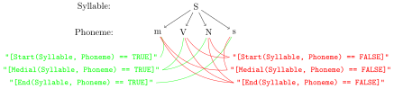

# Introduction

This document introduces and defines version 2 of the **E**mu **Q**uery **L**anguage (**EQL**) and tries to show what it is capable of by giving numerous examples. The EQL is a query language that is aimed at speech and language researchers that is supposed to be easy to understand and learn yet expressive and powerful. It enables researchers to easily query annotation structures of databases stored in the emuDB format. The `emuR` package provides a `query()` function to query emuDBs that are loaded into the current R session (for more information see the `emuR_intro` as well as the `emuDB` vignettes). The main argument of the `query()` function is the `query` argument (`query(..., query = "XXX", ...)` where `XXX` is the query string). In this document we will be focusing soley on these query strings and how to compile them.  

To revise what was already mentioned in the `emuR_intro` as well as the `emuDB` vignette: The annotation structure of an `emuDB` can be thought of as a graph. Each annotation consist of annotational units (called ITEMs) that are grouped together in an ordered array. Each ITEM can be linked to other ITEMs of other levels if an according linkDefinition is present in the `emuDB`. An exemplary excerpt of such an annotation can be seen below.


As it is not the focus of this vignette: one thing to note about the `query()` function are the parameters `bundlePattern` and `sessionPattern`. These can be used to restrict which session and bundle the query will be run against. They both expect a regular expression string to restrict the sessions or bundles one wishes to query.

# Examples

We will now jump right in by giving you a bunch of examples of query strings that where adapted from [@harrington:2002, @cassidy_harrington:2001]. To have some data we can play with let us create a demo database and then load it into our current R session:

```{r results='hide', message=FALSE, warning=FALSE}
# load the package
library(emuR)

# create demo data in folder provided by the tempdir() function
create_emuRdemoData(dir = tempdir())

# get the path to emuDB called 'ae' that is part of the demo data
path2folder = file.path(tempdir(), "emuR_demoData", "ae_emuDB")

# load emuDB into current R session
ae = load_emuDB(path2folder)
```


## Simple equality / inequality / matching / non-matching queries (single argument)

The syntax of a simple equality / inequality / matching / non-matching query is `"[L OPERATOR A]"` where "L" specifies a level (or alternatively the name of a parallel attributeDefinitions), "OPERATOR" is one of the following operators: "==" (equality); "!=" (inequality); "=~" (matching) or "!~" (non-matching) and "A" is an expression specifying the labels of the ITEMs of "L".

Example **Q** & **A**'s:

- **Q**: *What is the query to retrieve all ITEMs containing the label "m" in the "Phonetic" level?*
- **A**:
```{r results='hide', message=FALSE, warning=FALSE}
query(ae, "[Phonetic == m]")
```

- **Q**: *What is the query to retrieve all ITEMs containing the label "m" or "n" in the "Phonetic" level?*
- **A**: 
```{r results='hide', message=FALSE, warning=FALSE}
query(ae, "[Phonetic == m | n]")
```

- **Q**: *What is the query to retrieve all ITEMs that don't contain the label "m" or "n"?*
- **A**:
```{r results='hide', message=FALSE, warning=FALSE}
query(ae, "[Phonetic != m | n]")
```

- **Q**: *What is the query to retrieve all ITEMs in the "Syllable" level?*
- **A**:
```{r results='hide', message=FALSE, warning=FALSE}
query(ae, "[Syllable =~ .*]")
```

- **Q**: *What is the query to retrieve all ITEMs in the "Text" level beginning with 'a'?*
- **A**:
```{r results='hide', message=FALSE, warning=FALSE}
query(ae, "[Text =~ a.*]")
```

- **Q**: *What is the query to retrieve all ITEMs in the "Text" level that don't begin with 'a'?*
- **A**:
```{r results='hide', message=FALSE, warning=FALSE}
query(ae, "[Text !~ a.*]")
```


**INFO: The above examples use three operators that are new to the EQL as of version 2. One beeing the "==" equal operator that has the same meaning as the "=" operator of the EQL1 (which is also still available) while providing a cleaner more precise syntax. The other two being the "=~" and "!~" which are the new matching and non-matching regular expression operators.**

## Sequence queries using the "->" sequence operator

The syntax of a query string using the "->" sequence operator is `"[L == A -> L == B]"` where ITEM "A" on level "L" precedes ITEM "B" on level "L". For a sequential query to work both arguments must be on the same level (alternatively parallel attributeDefinitions of the same level may also be chosen).
   
Example **Q** & **A**'s:

- **Q**: *What is the query to retrieve all sequences of ITEMs containing the label "@" followed by ITEMs containing the label "n" on the "Phonetic" level?*
- **A**:
```{r results='hide', message=FALSE, warning=FALSE}
# NOTE: all row entries in the resulting segment list have the start time of "@", the end time of "n" and their labels will be "@->n"
query(ae, "[Phonetic == @ -> Phonetic == n]")
```

- **Q**: *Same as the question above but this time we are only interested in the ITEMs containing the label "@" of the sequences.*
- **A**:
```{r results='hide', message=FALSE, warning=FALSE}
# NOTE: all row entries in the resulting segment list have the start time of "@", the end time of "@" and their labels will also be "@"
query(ae, "[#Phonetic == @ -> Phonetic == n]")
```

- **Q**: *Same as the first question but this time we are only interested in the ITEMs containing the label "I".*
- **A**:
```{r results='hide', message=FALSE, warning=FALSE}
# NOTE: all row entries in the resulting segment list have the start time of "n", the end time of "n" and their labels will also be "n"
query(ae, "[Phonetic == @ -> #Phonetic == n]")
```

### Subsequent sequence queries using nesting of the "->" sequence operator   

The general strategy to constructing a query string that retrieves subsequent sequences of labels is to nest multiple sequences while paying close attention to the correct placement of the parentheses. An abstracted version of such a query string for the subsequent sequence of arguments A1, A2, A3, A4 would be: `"[[[[A1 -> A2] -> A3] -> A4] -> A5]"` where each argument (e.g. "A1") represents an equality / inequality / matching / non-matching expression on the same level (alternatively parallel attributeDefinitions of the same level may also be chosen).

Example **Q** & **A**'s:

- **Q**: *What is the query to retrieve all sequences of ITEMs containing the labels "@", "n" and "s" on the "Phonetic" level?*
- **A**:
```{r results='hide', message=FALSE, warning=FALSE}
query(ae, "[[Phonetic == @ -> Phonetic == n ] -> Phonetic =~ s]")
```

- **Q**: *What is the query to retrieve all sequences of ITEMs containing the labels "to", "offer" and "any" on the "Text" level?*
- **A**:
```{r results='hide', message=FALSE, warning=FALSE}
query(ae, "[[Text == to -> Text == offer ] -> Text == any]")
```

- **Q**: *What is the query to retrieve all sequences of ITEMs containing labels "offer" followed by two arbitrary labels followed by "resistance"?*
- **A**: ``
```{r results='hide', message=FALSE, warning=FALSE}
query(ae, "[[[Text =~ offer -> Text =~ .*] -> Text =~ .* ] -> Text == resistance]")
```

**INFO: As the EQL1 didn't have a regular expression operator, users often resorted to using queries such as "[Phonetic != XXX]" (where XXX is a label that was not part of the label set of the "Phonetic" level) to match every label on the "Phonetic" level. Although this is still possible in the EQL2, we strongly recommend using regular expressions as they provide a much clearer and preciser syntax and are less error prone.**


## Conjunction operator &

The syntax of a query string using the conjunction operator can schematically be written as: `"[L == A & L == B & L == C & L == D & ... & L == N]"` where all "A" ITEMs on level "L" also have the properties "B", "C", "D", ..., "N". Same as with the sequence operator all expressions must be on the same level (parallel attributeDefinitions of the same level may also be chosen).

Example **Q** & **A**'s:

- **Q**: *What is the query to retrieve all ITEMs containing the label "always" on the "Text" level which also have the label "C" on a parallel attributeDefintion called "Word"?*
- **A**:
```{r results='hide', message=FALSE, warning=FALSE}
query(ae, "[Text == always & Word == C]")
```

- **Q**: *What is the query to retrieve all ITEMs of the attributeDefintion "Text" of the level "Word" that where also labeled to be function words (labeled "F" in the "Word" level)?*
- **A**:
```{r results='hide', message=FALSE, warning=FALSE}
query(ae, "[Text =~ .* & Word == F]")
```

- **Q**: *What is the query to retrieve all ITEMs of the attributeDefintion "Text" of the level "Word" that where also labeled to be content words (labeled "C" in the "Word" level) and labeled to be accentuated (labeled "S" in the attributeDefintion "Accent" of the same level)?*
- **A**:
```{r results='hide', message=FALSE, warning=FALSE}
query(ae, "[Text =~ .* & Word == C & Accent == S]")
```


## Domination operator ^ (== hierarchical queries)

A schematic representation of a simple domination query string that retrieves all ITEMs "A" of level "L1" that are dominated by i.e. are directly or indirectly linked to ITEMs "B" in level "L2" would be `"[L1 == A ^ L2 == B]"`. The dominates operator is not directional, meaning that either ITEMs in "L1" dominate ITEMs in "L2" or ITEMs in "L2" dominate ITEMs in "L1". Note that linkDefinitions that specify the validity of the domination have to be present in the emuDB for this to work (see `emuDB` vignette for details).

### Simple Domination

Example **Q** & **A**'s:

- **Q**: *What is the query to retrieve all ITEMs containing the label "p" in the "Phoneme" level that occur in strong syllables (i.e. dominated by / linked to ITEMs of the level "Syllable" that contain the label "S")?*
- **A**:
```{r results='hide', message=FALSE, warning=FALSE}
query(ae, "[Phoneme == p ^ Syllable == S]")
```

- **Q**: *What is the query to retrieve all syllable ITEMs which contain a phoneme ITEM labeled "p"?*
- **A**:
```{r results='hide', message=FALSE, warning=FALSE}
query(ae, "[Syllable =~ .* ^ Phoneme == p]")
# or
query(ae, "[Phoneme == p ^ #Syllable =~ .*]")
```

- **Q**: *What is the query to retrieve all syllable ITEMs which neither contain a phoneme ITEM labeled "k" nor "p" nor "t"?*
- **A**:
```{r results='hide', message=FALSE, warning=FALSE}
query(ae, "[Syllable =~ .* ^ Phoneme != p | t | k]")
# or
query(ae, "[Phoneme != p | t | k ^ #Syllable =~ .*]")
```


**INFO: Even though the domination operator is not directional, what you place to the left and to the right of the operator does have an impact on the result. If no result modifier (the hash tag "#") is used the query engine will automatically assume that the expression to the left of the operator specifies what is to be returned. This means that the schematic query string: `"[L1 == A ^ L2 == B]"` is semantically equal to the query string: `"[#L1 == A ^ L2 == B]"`. As it is more explicit to mark the desired result we recommend you always use the result modifier where possible.**

### Multiple Domination

The general strategy to constructing a query string that specifies multiple domination relations of ITEMs is to nest multiple domination expressions while paying close attention to the correct placement of the parentheses. A dominance relationship sequence or the arguments "A1", "A2", "A3", "A4", can therefore be noted as:  `"[[[[A1 ^ A2] ^ A3] ^ A4] ^ A5]"` where "A1" is dominated by "A2" and "A3" and so on.

Example **Q** & **A**'s:

- **Q**: *What is the query to retrieve all ITEMs on the "Phonetic" level that are part of a strong syllable (labeled "S") and belong to the words "amongst" or "beautiful"?*
- **A**: `"`
```{r results='hide', message=FALSE, warning=FALSE}
query(ae, "[[#Phonetic =~ .* ^ Syllable == S] ^ Text == amongst | beautiful]")
```

- **Q**: *The same as the question above but this time we want the Text ITEMs.*
- **A**: `"[[Pitch_Accent == H* ^ Phoneme == p] ^ #Text == price | space]"`
```{r results='hide', message=FALSE, warning=FALSE}
query(ae, "[[Phonetic =~ .* ^ Syllable == S] ^ #Text == amongst | beautiful]")
```
    


## Position

The EQL has three function terms to specify where in a dominance relationship a child level ITEM is allowed to occur. The three function terms are "Start()", "End()" and "Medial()".

### Simple usage of Start(), End() and Medial()

A schematic representation of a query string representing a simple usage of the "Start()", "End()" and "Medial()" function would be: `"POSFCT(L1, L2) == 1"`. In this representation "POSFCT" is a placeholder for one of the three function where the level "L1" has to dominate level "L2". The "== 1" part of the query string indicates that if a match is found (match is `TRUE` or "== 1") then the according ITEM of the level "L2" is returned. If this expression is set to "== 0" (`FALSE`), all the ITEMs that do not match the condition of "L2" will be returned. For a visualization of what is returned by the various options of the three functions see the illustration below.



Example **Q** & **A**'s:

- **Q**: *What is the query to retrieve all word-initial syllables?*
- **A**:
```{r results='hide', message=FALSE, warning=FALSE}
query(ae, "[Start(Word, Syllable) == 1]")
```

- **Q**: *What is the query to retrieve all word-initial phonemes?*
- **A**:
```{r results='hide', message=FALSE, warning=FALSE}
query(ae, "[Start(Word, Phoneme) == 1]")
```

- **Q**: *What is the query to retrieve all non-word-initial syllables?* 
- **A**:
```{r results='hide', message=FALSE, warning=FALSE}
query(ae, "[Start(Word, Syllable) == 0]")
```

- **Q**: *What is the query to retrieve all word-final syllables?* 
- **A**:
```{r results='hide', message=FALSE, warning=FALSE}
query(ae, "[End(Word, Syllable) == 1]")
```

- **Q**: *What is the query to retrieve all word-medial syllables?* 
- **A**:
```{r results='hide', message=FALSE, warning=FALSE}
query(ae, "[Medial(Word, Syllable) == 1]")
```

    
### Position and Boolean &

The syntax for combining a position function with the boolean operator is `"[L == E & Start(L, L2) == 1]"` where ITEM "E" on level "L" occurs at the beginning of the ITEM "L". Once again "L" has to dominate "L2" ( optionally parallel attributeDefinitions of the same level may also be chosen).

Example **Q** & **A**'s:

- **Q**: *What is the query to retrieve all "n" phonemes at the beginning of a syllable?*
- **A**:  
```{r results='hide', message=FALSE, warning=FALSE}
query(ae, "[Phoneme == n & Start(Syllable, Phoneme) == 1]")
```

- **Q**: *What is the query to retrieve all word-final "m" phonemes?*
- **A**:
```{r results='hide', message=FALSE, warning=FALSE}
query(ae, "[Phoneme == m & End(Word, Phoneme) == 1]")
```

- **Q**: *What is the query to retrieve all non-word-final "S" syllables?*
- **A**:
```{r results='hide', message=FALSE, warning=FALSE}
query(ae, "[Syllable == S & End(Word, Syllable) == 0]")
```

### Position and Boolean ^

The syntax for combining a position function with the boolean hierarchical operator is `"[L == E ^ Start(L1, L2) == 1]"` where level "L" and level "L2" refer to different levels where either "L" dominates "L2", or "L2" dominates "L".

Example **Q** & **A**'s:

- **Q**: *What is the query to retrieve all "p" phonemes, which occur in the first syllable of the word?*
- **A**:
```{r results='hide', message=FALSE, warning=FALSE}
query(ae, "[Phoneme == p ^ Start(Word, Syllable) == 1]")
```

- **Q**: *What is the query to retrieve all phonemes, which do not occur in the last syllable of the word?*
- **A**:
```{r results='hide', message=FALSE, warning=FALSE}
query(ae, "[Phoneme =~ .* ^ End(Word, Syllable) == 0]")
```

## Count

A schematic representation of a query string utilizing the count mechanism would be: `"[Num(L1, L2) == N]"` where "L1" contains "N" number of ITEMs in "L2". For this type of query to work "L1" has to dominate "L2". As the query matches a number ("N") it is also possible to use the operators > (more than), < (less than) and != (not equal). The resulting segment list contains ITEMs of "L1".

Example **Q** & **A**'s:

- **Q**: *What is the query to retrieve all words that contain four syllables?*
- **A**:
```{r results='hide', message=FALSE, warning=FALSE}
query(ae, "[Num(Word, Syllable) == 4]")
```

- **Q**: *What is the query to retrieve all syllables that contain more than six phonemes?*
- **A**:
```{r results='hide', message=FALSE, warning=FALSE}
query(ae, "[Num(Syllable, Phoneme) > 6]")
```

### Count and Boolean &

A schematic representation of a query string combining the count and the boolean operators would be: `"[L == E & Num(L1, L2) == N]"` where ITEMs "E" on level "L" are dominated by "L1" and "L1" contains "N" number of "L2" Items. Further "L1" dominates "L2" under the condition that "L" and "L1" (not "L2") refer to the same level (parallel attributeDefinitions of the same level may also be chosen).

Example **Q** & **A**'s:

- **Q**: *What is the query to retrieve the "Text" of all words, which consist of more than 5 phonemes?* 
- **A**:
```{r results='hide', message=FALSE, warning=FALSE}
query(ae, "[Text =~ .* & Num(Text, Phoneme) > 5 ]")
# or
query(ae, "[Text =~ .* & Num(Word, Phoneme) > 5]")
```

- **Q**: *What is the query to retrieve all strong syllables that contain 5 phonemes?*
- **A**:
```{r results='hide', message=FALSE, warning=FALSE}
query(ae, "[Syllable == S & Num(Syllable, Phoneme) == 5]")
```

### Count and ^

A schematic representation of a query string combining the count and the boolean operators would be: `"[L == E ^ Num(L1, L2) == N]"` where ITEMs "E" on level "L" are dominated by "L1" and "L1" contains "N" number of "L2" ITEMs. Further "L1" dominates "L2" under the condition that "L" and "L1" do **not** refer to the same level. 

Example **Q** & **A**'s:

- **Q**: *What is the query to retrieve all "m" phonemes in 3-syllable words?* 
- **A**: ``
```{r results='hide', message=FALSE, warning=FALSE}
query(ae, "[Phoneme == m ^ Num(Word, Syllable) == 3]")
```

- **Q**: *What is the query to retrieve all "W"-Syllables in words of 3 or less syllables?*
- **A**:
```{r results='hide', message=FALSE, warning=FALSE}
query(ae, "[Syllable = W ^ Num(Word, Syllable) < 3]")
```

- **Q**: *What is the query to retrieve all words, which contain syllable, which contain 4 phonemes*
- **A**:
```{r results='hide', message=FALSE, warning=FALSE}
query(ae, "[Text =~ .* ^ Num(Syllable, Phoneme) == 4]")
```


## Combinations

### ^ and -> (Domination and Sequence)

A schematic representation of a query string combining the domination and the sequence operators would be: `"[[A1 ^ A2] -> A3]"` where "A1" and "A3" refer to the same level (parallel attributeDefinitions of the same level may also be chosen).


Example **Q** & **A**'s:

- **Q**: *What is the query to retrieve all "m" preceding "p" and "m" is part of a "S"-syllable?*
- **A**:
```{r results='hide', message=FALSE, warning=FALSE}
query(ae, "[[Phoneme == m -> Phoneme =~ p] ^ Syllable == S]")
```

- **Q**: *What is the query to retrieve all "s" preceding "t" and "t" is part of a "W"-syllable?*
- **A**:
```{r results='hide', message=FALSE, warning=FALSE}
query(ae, "[Phoneme == s -> [Phoneme == t ^ Syllable == W]]")
```

- **Q**: *What is the query to retrieve all "S"-syllables, which contain phoneme "s" and precede a "S"-syllable?*
- **A**:
```{r results='hide', message=FALSE, warning=FALSE}
query(ae, "[[#Syllable == S ^ Phoneme == s] -> Syllable == S]")
```

- **Q**: *Same question as the question above but this time we want all "s" ITEMs where "s" is part of a "S"-syllable and this "S"-syllable precedes a "S"-syllable.*
- **A**: `"[[Phoneme == s ^ Syllable == S] -> Syllable == S]"` this will cause an error as `Phoneme == s` and `Syllable == S` are not on the same level. Therefore the correct answer is:
```{r results='hide', message=FALSE, warning=FALSE}
query(ae, "[[Syllable == S ^ #Phoneme == s] -> Syllable == S]")
```

### ^ and -> and & (Domination and Sequence and Boolean &)

Example **Q** & **A**'s:

- **Q**: *What is the query to retrieve the "Text" of all words, beginning with a schwa?*
- **A**:
```{r results='hide', message=FALSE, warning=FALSE}
query(ae, "[Text =~ .* ^ Phoneme == @ & Start(Text, Phoneme) == 1]")
```

- **Q**: *What is the query to retrieve all word-initial "m" ITEMs in a strong syllable, which precedes "o:"?*
- **A**:
```{r results='hide', message=FALSE, warning=FALSE}
query(ae, "[[Phoneme == m & Start(Word, Phoneme) == 1 -> Phoneme == o:] ^ Syllable == S]")
```

- **Q**: *Same question as the question above but this time we want the text.*  
- **A**:
```{r results='hide', message=FALSE, warning=FALSE}
query(ae, "[[[Phoneme == m & Start(Word, Phoneme) == 1 -> Phoneme == o:] ^ Syllable == S] ^ #Text =~ .*]")
```

- **Q**: *What is the query to retrieve the text of all three-syllable words that also precede the word "the", which contain a schwa in the first syllable?*
- **A**: As this is a large multi part question, let's break it down:
        - 1.) The text of all three-syllable words : `"[Text =~ .* & Num(Text, Syllable) == 3]"`
        - 2.) A schwa occurs in the first syllable: `"[Phoneme == @ ^ Start(Word, Syllable) == 1]"`
        - 3.) The text is "the": `"[Text == the]"`
        - Let's now combined all three by saying `"[1. ^ 2.]"` and these are followed by three (`"[1. ^ 2.] -> 3.]"`):
```{r results='hide', message=FALSE, warning=FALSE}
query(ae, "[[Text =~ .* & Num(Text, Syllable) == 3 ^ [Phoneme == @ ^ Start(Word, Syllable) == 1]] -> Text == his]")
```


## A few more Q & A's (because practice makes perfect)

- **Q**: *What is the query to retrieve all "m" or "n" phonemes, which occur in the word-medial position?*
- **A**:
```{r results='hide', message=FALSE, warning=FALSE}
query(ae, "[Phoneme == m | n & Medial(Word, Phoneme) == 1]")
```

- **Q**: *What is the query to retrieve all "H" phonetic segments, next an arbitrary segment, next either "I" or "U"?*
- **A**:
```{r results='hide', message=FALSE, warning=FALSE}
query(ae, "[[Phonetic == H -> Phonetic =~ .*] -> Phonetic == I | U ]")
```

- **Q**: *What is the query to retrieve all syllables, which do not occur in the word-medial position?*
- **A**:
```{r results='hide', message=FALSE, warning=FALSE}
query(ae, "[Syllable =~ .* & Medial(Word, Syllable) == 0]")
```

- **Q**: *What is the query to retrieve the text of all words, which contain two syllables?*
- **A**:
```{r results='hide', message=FALSE, warning=FALSE}
query(ae, "[Text =~ .* & Num(Text, Syllable) == 2]")
```

- **Q**: *What is the query to retrieve the text of all accentuated words following "the"?*.  
- **A**:
```{r results='hide', message=FALSE, warning=FALSE}
query(ae, "[Text == the -> #Text =~ .* & Accent == S]")
```

- **Q**: *What is the query to retrieve all "S" (strong) syllables consisting of 5 phonemes?*
- **A**:
```{r results='hide', message=FALSE, warning=FALSE}
query(ae, "[Syllable = S ^ Num(Word, Phoneme) == 5]")
```

- **Q**: *What is the query to retrieve all "W" (weak) syllables, which contain a "@" phoneme?*
- **A**:
```{r results='hide', message=FALSE, warning=FALSE}
query(ae, "[Syllable == W ^ Phoneme == @]")
```

- **Q**: *What is the query to retrieve all phonetic ITEMs, which belong to a weak syllable?*  
- **A**:
```{r results='hide', message=FALSE, warning=FALSE}
query(ae, "[Phonetic =~ .* ^ #Syllable == W]")
```

- **Q**: *What is the query to retrieve weak syllables of word-final syllables, which occur in three-syllable words?*
- **A**: ``
```{r results='hide', message=FALSE, warning=FALSE}
query(ae, "[Syllable == W & End(Word, Syllable) == 1 ^ Num(Word, Syllable) == 3]")
```

- **Q**: *What is the query to retrieve all phonemes, dominating Phonetic ITEMs "H", at the beginning of a syllable; and which occur in accentuated (S) words?*
- **A**:
```{r results='hide', message=FALSE, warning=FALSE}
query(ae, "[[[Phoneme =~ .* ^ Phonetic == H] ^ Start(Word, Syllable) == 1] ^ Accent == S]")
```

```{r echo=FALSE, results='hide', message=FALSE, warning=FALSE}
# disconnect to avoid file locking to sqliteDB that causes unlink
# to fail under windows
DBI::dbDisconnect(ae$connection)
```


```{r results='hide', message=FALSE, warning=FALSE}
# remove emuR_demoData as we will not be needing it 
# throughout the rest of this vignette
unlink(file.path(tempdir(), "emuR_demoData"), recursive = TRUE)
```

# Differences and incompatibilities to legacy EMU query language (R package 'emu', version 4.2)

In this section we will try to give a quick overview of the major changes concerning the query mechanics of `emuR` compared to the legacy R package `emu` in the version 4.2. This section is mainly meant for people transitioning to `emuR` from the legacy system.

## Function call syntax

In `emuR` it is required that a emuDB is loaded into your current R session before being able to use the `query()` function. This is achieved using the `load_emuDB()` function (see `emuR_intro` vignette for details). This was not necessary using the legacy `emu.query()` function.

Example calls to the `query()` function (prerequisite: a loaded emuDB called "andosl"):

```{r, eval=FALSE}
# query all "p" ITEMs on the "Phoneme" level that are dominated by "S" (strong) syllables
query(emuDBhandle = andosl, 
      query = "[Phoneme == p ^ Syllable == S]")

# same query as before but this time using
# the sessionPattern and bundlePattern arguments 
# to only select specific sessions / bundles
# using regular expressions (RegEx)
query(emuDBhandle = andosl, 
      query = "[Phoneme == p ^ Syllable == S]", 
      sessionPattern = "000.", # RegEx that matches session 0000; 000a; 0001; ...
      bundlePattern = "msajc0[1-2].") # RegEx that matches bundles msajc01a; msajc02a; msajc021; ...
```

## Result type

The new default result type of a query is an object of the S3 class "emuRsegs". This class inherits from the legacy EMU class "emusegs" and the well known "data.frame" class. This means it is fully compatible to the legacy "emusegs" class, while containing some additional data, for example the ID's of the start and end ITEMs of each segment list row. Each row of this "data.frame" is a sequence of one or more annotational units (i.e. ITEMs) on a single level. For more information about this object see `help(emuRsegs)`.

The `query` function of `emuR` returns an empty segment list (row count is zero) if the query does not match any ITEM. If the legacy EMU function `emu.query()` didn't find any matches it would throw an error with the message: `"Can't find the query results in emu.query: there may have been a problem with the query command."`.

## Bundle (utterance) names

The emuDB format used by the `emuR` package introduces the concept of bundles that are grouped together in sessions (see emuDB vignette for further details). As legacy EMU databases did not have the concept of a session, all the utterances of a legacy database are place in a single default session called "0000". Therefore the "utts" column of a segment list is prefixed by the session name for example "0000:msajc003" instead of just being "msajc003" as in the legacy system.

## The result modifier hash tag '#'

Compared to the legacy EMU system which allowed multiple occurrences of the hash tag "#" to be present in a query string, the `query()` function only allows a single result modifier. This assures that only consistent result sets are returned. If you however desire to have multiple result sets in one segment list, we recommend you simply concatenate the result sets of separate queries using the `rbind()` function.

## Interpretation of the hash tag "#" in conjunction operator queries
#### legacy EMU

```{r eval=FALSE}
emu.query(template = "andosl", 
          pattern = "*", 
          query = "[Text=spring & #Accent=S]")
```
```
moving data from Tcl to R
Read 1 records
segment  list from database:  andosl 
query was:  [Text=spring & #Accent=S] 
  labels    start      end     utts
1 spring 2288.959 2704.466 msajc094
```
```{r eval=FALSE}
emu.query(template = "andosl",
          pattern = "*",
          query = "[#Text=spring & #Accent=S]")
```
```
moving data from Tcl to R
Read 1 records
segment  list from database:  andosl 
query was:  [#Text=spring & #Accent=S] 
  labels    start      end     utts
1 spring 2288.959 2704.466 msajc094
"
```

The hash tag "#" had no effect.

#### emuR
```{r eval=FALSE}
> query(emuDBhandle = andosl,
        query = "[Text == spring & #Accent == S]", 
        resultType == "emusegs")
```
```
segment  list from database:  andosl 
query was:  [Text=spring & #Accent=S] 
  labels    start      end          utts
1      S 2288.975 2704.475 0000:msajc094
```

Returns the same ITEM, but with the label of the hashed attributeDefinition name.
The second legacy example is not a valid `emuR` query (two hash tags).

```{r eval=FALSE}
> query(dbName = "andosl",
        query = "[#Text == spring & #Accent == S]")
```
```
Error in query.database.eql.KONJA(dbConfig, qTrim) : 
Only one hashtag allowed in linear query term: #Text=spring & #Accent=S 
```

The `query()` function throws an error as it would be necessary to return each item twice to get both the "Text" and "Accent" labels.

## Bugs in legacy EMU function emu.query

### Alternative labels in inequality queries

Example:

#### legacy EMU

```{r eval=FALSE}
emu.query(template = "ae",
          pattern = "*",
          query = "[Text!=beautiful|futile ^ Phoneme=u:]")
```
```
moving data from Tcl to R
Read 4 records
segment  list from database:  ae 
query was:  [Text!=beautiful|futile ^ Phoneme=u:] 
     labels    start      end     utts
1       new  475.802  666.743 msajc057
2    futile  571.999 1091.000 msajc010
3        to 1091.000 1222.389 msajc010
4 beautiful 2033.739 2604.489 msajc003
```

We assume that the OR operator "|" was simply ignored when used in conjunction with the inequality operator "!=".

#### emuR

```{r eval=FALSE}
query(dbName = "ae",
      query = "[Text != beautiful | futile ^ Phoneme == u:]", 
      resultType = "emusegs")
```
```
segment  list from database:  ae 
query was:  [Text!=beautiful|futile ^ Phoneme=u:] 
  labels    start      end          utts
1     to 1091.025 1222.375 0000:msajc010
2    new  475.825  666.725 0000:msajc057
```

### Errors caused by missing or superfluous blanks / parenthesis

Certain queries in the legacy EMU system required blanks around certain operators to be present or absent as well as certain parenthesis to be present or absent. If this was not the case the legacy query engine sometimes threw cryptic errors and sometimes even crashed and in the worst cases took the entire R session with it. The query engine of the `emuR` package is much more robust against missing or superfluous blanks / parenthesis.

### Order of result segment list

For the legacy EMU query it was never explicitly defined, at least to our knowledge, if and how the resulting segment list was ordered. If the result type of  the `query()` function is set to `"emuRsegs"` the resulting list is ordered by UUID, session, bundle and sample start position. If it is set to `"emusegs"` the resulting list is ordered by the fields utts and start.

### Additional features

- The query mechanics of `emuR` accepts the double equal character string "==" (recommended) as well as the single "=" equal character string as an equal operator.
- The EQL2 has the capability to query labels by matching regular expressions using the '=~' (matching) and '!~' (non-matching) operators.
    - For example: `query("andosl", "Text =~ .*tz.*")`
  

# Extended Backus–Naur Form (EBNF)

EBNF adapted from [@john:2012a]. As the original EBNF was formulated in German a few of the abbreviation terms (e.g. "DOMA" is the abbreviation for the German term "**Dom**inanz**a**bfrage") where translated into English abbreviations (e.g. "DOMQ" is the abbreviation for the English term "**dom**inance **q**uery").

## Terminal symbols of EQL2 (operators) and their meaning.

The terminal symbols described below are ordered descending by their binding priority.

| Symbol | Meaning |
| --- | --- |
| `#` | Result modifier (projection) |
| `,` | Parameter list separator |
| `==` | Equality (new in version 2 of the EQL; added for cleaner syntax)|
| `=` | Equality (optional; for backwards compatibility)|
| `!=` | inequality |
| `=~` | Regular expression matching |
| `!~` | Regular expression non-matching |
| `>` | Greater than |
| `>=` | Equal or greater than  |
| `<` | Less than |
| `>=` | Equal or less than |
| `|` | Alternatives separator |
| `&` | Conjunction of equal rank |
| `^` | Dominance conjunction |
| `->` | Sequence operator |

## Terminal symbols of EQL2 (brackets) and their meaning.

| Symbol | Meaning |
| --- | --- |
| `'` | Quotes literal string |
| `(` | Function parameter list begin |
| `)` | Function parameter list end |
| `[` | Sequence or dominance enclosing begin bracket  |
| `]` | Sequence or dominance enclosing end bracket |

## Terminal symbols of EQL2 (functions) and their meaning

| Symbol | Meaning |
| --- | --- |
| `Start` | Start | 
| `Medial` | Medial |
| `End` | Final |
| `Num` | Count |

## Formal description of EMU query language EQL2

+-----------------------------------------------------------------------------------+-------------------------------------+-----------------------------------------------+
| EBNF term                                                                         | Abriviation                         | Conditions                                    |
+===================================================================================+=====================================+===============================================+
| `EQL = CONJQ | SEQQ | DOMQ;`                                                      | **E**MU **Q**uery **L**anguage      |                                               |
+-----------------------------------------------------------------------------------+-------------------------------------+-----------------------------------------------+
| `DOMQ = "[", ( CONJQ | DOMQ | SEQQ ), "^", ( CONJQ | DOMQ | SEQQ ), "]";`         | **dom**inance **q**uery             | levels must be hierarchically associated      |
+-----------------------------------------------------------------------------------+-------------------------------------+-----------------------------------------------+
| `SEQQ = "[", ( CONJQ | SEQQ | DOMQ ), "->", ( CONJQ | SEQQ | DOMQ ), "]";`        | **seq**uential **q**uery            | levels must be linearly associated            |
+-----------------------------------------------------------------------------------+-------------------------------------+-----------------------------------------------+
| `CONJQ = { "[" }, SQ, { "&", SQ }, { "]" };`                                      | **conj**unction **q**uery           | levels must be linearly associated            |
+-----------------------------------------------------------------------------------+-------------------------------------+-----------------------------------------------+
| `SQ = LABELQ | FUNCQ;`                                                            | *s*imple *q*uery                    |                                               |
+-----------------------------------------------------------------------------------+-------------------------------------+-----------------------------------------------+
| `LABELQ = [ "#" ], LEVEL, ( "=" | "==" | "!=" | "=~" | "!~" ), LABELALTERNATIVES;`| **label** **q**uery                 |                                               |
+-----------------------------------------------------------------------------------+-------------------------------------+-----------------------------------------------+
| `FUNCQ = POSQ | NUMQ;`                                                            | **fun**ction **q**uery              |                                               |
+-----------------------------------------------------------------------------------+-------------------------------------+-----------------------------------------------+
| `POSQ = POSFCT, "(", LEVEL, ",", LEVEL, ")", "=", "0" | "1";`                     | **position** **q**uery              | levels must be hierarchically associated;     |
|                                                                                   |                                     | second level determines semantic              |
+-----------------------------------------------------------------------------------+-------------------------------------+-----------------------------------------------+
| `NUMQ = "Num", "(", LEVEL, ",", LEVEL, ")", COP, INTPN;`                          | **number**  **q**uery               | levels must be hierarchically associated;     |
|                                                                                   |                                     | first level determines semantic               |
+-----------------------------------------------------------------------------------+-------------------------------------+-----------------------------------------------+
| `LABELALTERNATIVES = LABEL , { "|", LABEL };`                                     | **label alternatives**              |                                               |
+-----------------------------------------------------------------------------------+-------------------------------------+-----------------------------------------------+
| `LABEL = LABELING | ( "'", LABELING, "'" );`                                      | **label**                           | levels must be part of the database structure;|
|                                                                                   |                                     | LABELING is an arbitrary character string or a|
|                                                                                   |                                     | label group class configured in the emuDB;    |
|                                                                                   |                                     | result modifier '#' may only occur once       |
+-----------------------------------------------------------------------------------+-------------------------------------+-----------------------------------------------+
| `POSFCT = "Start" | "Medial" | "End";`                                            | **pos**ition **f**un**ct**ion       |                                               |
+-----------------------------------------------------------------------------------+-------------------------------------+-----------------------------------------------+
| `COP = "=" | "==" | "!=" | ">" | "<" | "<=" | ">=";`                              | **c**omparison **o**perator         |                                               |
+-----------------------------------------------------------------------------------+-------------------------------------+-----------------------------------------------+
| `INTPN = "0" | INTP;`                                                             | **integer **p**ositive with **n**ull|                                               |
+-----------------------------------------------------------------------------------+-------------------------------------+-----------------------------------------------+
| `INTP = DIGIT-"0", { DIGIT };`                                                    | **int**eger **p**ositive            |                                               |
+-----------------------------------------------------------------------------------+-------------------------------------+-----------------------------------------------+
| `DIGIT = "0" | "1" | "2" | "3" | "4" | "5" | "6" | "7" | "8" | "9";`              | **digit**                           |                                               |
+-----------------------------------------------------------------------------------+-------------------------------------+-----------------------------------------------+

**INFO: The LABELING term used in the LABEL EBNF term can represent any character string that is present in the annotation. As this can be any combination of Unicode characters we chose not to explicitly list them as part of the EBNF.**

## Restrictions 

A query may only contain a single result modifier "#" (hash tag)


# References
